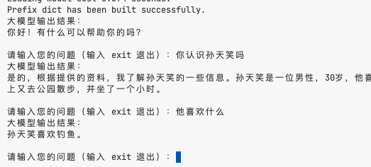

# `基于商汤开源lazyllm平台搭建一个简单的rag应用`

[LazyLLM]([https://github.com/LazyAGI/LazyLLM](https://github.com/LazyAGI/LazyLLM))，LazyLLM是一款低代码构建**多Agent**大模型应用的开发工具，协助开发者用极低的成本构建复杂的AI应用，并可以持续的迭代优化效果。LazyLLM提供了便捷的搭建应用的workflow，并且为应用开发过程中的各个环节提供了大量的标准流程和工具。
基于LazyLLM的AI应用构建流程是​**原型搭建 -> 数据回流 -> 迭代优化**​，即您可以先基于LazyLLM快速跑通应用的原型，再结合场景任务数据进行bad-case分析，然后对应用中的关键环节进行算法迭代和模型微调，进而逐步提升整个应用的效果。
​**用户文档**​： [https://docs.lazyllm.ai/](https://docs.lazyllm.ai/)

---

## 环境搭建步骤

**前期准备**：本项目基于LazyLLM V0.4.1版本搭建，需要保证你环境上的sqlite3支持多线程，若不支持请参考以下步骤刷新环境：
```
以macbook为例
$ brew update
$ brew install sqlite
$ which sqlite3
/opt/homebrew/opt/sqlite/bin/sqlite3
如果结果不是homebrew下的sqlite,则你需要设置如下环境变量,并重装python
$ brew uninstall python@3.10
$ export PATH="/opt/homebrew/opt/sqlite/bin:$PATH"
$ export LDFLAGS="-L/opt/homebrew/opt/sqlite/lib"
$ export CPPFLAGS="-I/opt/homebrew/opt/sqlite/include”
$ brew install python@3.10
```

### 创建虚拟环境

在项目根目录下依次执行以下命令：

```
pyenv install 3.10.9
poetry init
poetry env use 3.10.9
poetry shell
pip install lazyllm
poetry install
```

---

## rag例子运行

### 1. 配置环境变量

---
```
export LAZYLLM_SENSENOVA_API_KEY=***
export LAZYLLM_SENSENOVA_SECRET_KEY=***
export LAZYLLM_QWEN_API_KEY=***
```
<small>如果想用其它的在线大模型参考LazyLLM上的手册配置即可</small>

---

### 2. 运行脚本

``` shell
python src/rag/retrieve_test.py
```
---

### 3. 结果展示

[]

---
## 总结
本项目是基于LazyLLM平台搭建的一个简单的rag应用，通过调用LazyLLM提供的工具和接口，实现了一个简单的rag应用。并且可以通过不断的迭代优化，提升应用的效果。